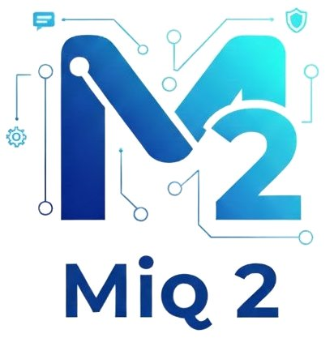

#  Miq2


---
**Sistema Integrado de Gestão de Projetos, Serviços e Atendimento (Service Desk)**

[]()
[]()

---

## 📋 Sobre o Projeto

O **Miq2** é uma plataforma web desenvolvida para a **Acesso Informática**, empresa especializada em softwares ERP para o setor varejista e tributário. O sistema centraliza:

- 📊 **Gestão de Implantações** - Controle de implantações de ERP com cronogramas Gantt
- 🔧 **Ordens de Serviço** - Gerenciamento de manutenção de hardware
- 💬 **Central de Atendimento** - Chat omnichannel integrado ao WhatsApp
- 📁 **Repositório Técnico** - GED com versionamento de artefatos
- 📅 **Gestão de Agendas** - Calendário híbrido para equipes técnicas

---

## ✨ Funcionalidades Principais

### Para Administradores
- Gestão de equipes, cargos e permissões granulares
- Cadastro de produtos e checklists de implantação
- Dashboard de cronograma geral
- Monitoramento de fila de atendimento em tempo real
- Geração automática de pauta de reunião (Sprint)

### Para Técnicos/Atendentes
- Dashboard de calendário/agenda
- Controle de implantações com checklist
- Gerenciamento de Ordens de Serviço
- Tela de atendimento omnichannel
- Repositório de documentos versionados

### Para Clientes (via WhatsApp)
- Menu de triagem automatizado
- Consulta de status de implantação/manutenção
- Consulta de pendências financeiras
- Segunda via de boleto automática

---

## 🏗️ Arquitetura

```
Frontend (React.js)  →  Backend (FastAPI)  →  PostgreSQL
                              ↓
                    ┌─────────┴─────────┐
                    ↓                   ↓
              WhatsApp API       API Financeira
```

---

## 🛠️ Stack Tecnológica

| Camada | Tecnologias |
|--------|-------------|
| **Frontend** | React.js, TypeScript, Ant Design |
| **Backend** | Python, FastAPI, SQLAlchemy |
| **Banco de Dados** | PostgreSQL |
| **Cache** | Redis |
| **Storage** | MinIO (Object Storage) |
| **Containerização** | Docker, Docker Compose |

---

## 📁 Estrutura do Projeto

```
Miq2/
├── docs/
│   ├── development_plan.md    # Plano de desenvolvimento detalhado
│   └── PRD.md                 # Product Requirements Document
├── backend/                   # API FastAPI
│   ├── app/
│   │   ├── models/            # Modelos SQLAlchemy
│   │   ├── schemas/           # Schemas Pydantic
│   │   ├── routers/           # Endpoints API
│   │   ├── services/          # Lógica de negócio
│   │   └── middleware/        # Autenticação
│   ├── seed.py                # Seed de dados iniciais
│   └── Dockerfile
├── frontend/                  # React App
│   ├── src/
│   │   ├── components/        # Componentes reutilizáveis
│   │   ├── pages/             # Páginas da aplicação
│   │   ├── services/          # Chamadas API
│   │   └── contexts/          # Contextos React
│   └── Dockerfile
├── docker-compose.yml         # Orquestração de containers
└── README.md                  # Este arquivo
```

---

## 🚀 Quick Start

### Pré-requisitos

- Python 3.11+
- Node.js 18+
- PostgreSQL 15+
- Docker & Docker Compose (recomendado)

### Instalação

```bash
# Clone o repositório
git clone https://github.com/AlessandroVOliveira/Miq2.git
cd Miq2

# Com Docker (recomendado)
docker-compose up -d

# Aguarde os containers iniciarem e acesse:
# Frontend: http://localhost:3000
# Backend API: http://localhost:8000
# API Docs: http://localhost:8000/docs
```

---

## 🔐 Credenciais de Acesso

Ao executar o `docker-compose up`, o sistema cria automaticamente um usuário administrador:

| Campo | Valor |
|-------|-------|
| **Email** | `admin@miq2.com` |
| **Senha** | `admin123` |
| **Tipo** | Super Usuário (acesso total) |

> ⚠️ **Importante:** Altere a senha do administrador após o primeiro acesso em produção!

---

## ⚙️ Configuração (.env)

O projeto utiliza variáveis de ambiente para configuração de segurança e serviços. Existem arquivos de exemplo (`.env.example`) que devem ser copiados para `.env` e configurados antes do deploy:

| Serviço | Localização do Exemplo | Descrição |
|---------|------------------------|-----------|
| **Docker Global** | `./.env.example` | Variáveis globais (Postgres, Senhas Admin) |
| **Backend** | `./backend/.env.example` | Configurações específicas da API Python |
| **Evolution API** | `./evolution-api/.env.example` | Configurações da API de WhatsApp |

> **Nota:** Certifique-se de alterar as chaves e senhas padrão ao implantar em produção!

---

## 📖 Documentação

| Documento | Descrição |
|-----------|-----------|
| [Plano de Desenvolvimento](docs/development_plan.md) | Fases e módulos do projeto |
| [PRD](docs/PRD.md) | Requisitos funcionais e não funcionais |

---

## 🗓️ Roadmap

- [x] Documentação inicial (PRD e Plano de Desenvolvimento)
- [x] **Fase 1:** Core do sistema (Auth, Usuários, Equipes, Cargos, Clientes) ✅
- [x] **Fase 2:** Módulo de Implantações (Gantt, Checklists) ✅
- [x] **Fase 3:** Ordens de Serviço e Agenda ✅
- [x] **Fase 4:** Sprint e Reunião Semanal ✅
- [x] **Fase 5:** Repositório e Dashboards ✅
- [ ] **Fase 6:** Central de Atendimento (integração WhatsApp existente)
- [ ] **Fase 7:** Chatbot (integração com bot existente)

---

## 👥 Equipe

| Nome | Papel |
|------|-------|
| Alessandro | Desenvolvedor |
| Odilon | Técnico |
| Daiesa | Técnico |

---

## 📄 Licença

Este projeto é propriedade da **Acesso Informática**. Todos os direitos reservados.

---

## 📞 Contato

Para mais informações sobre o projeto, entre em contato com a equipe de desenvolvimento.

---

*Desenvolvido para a Acesso Informática*
