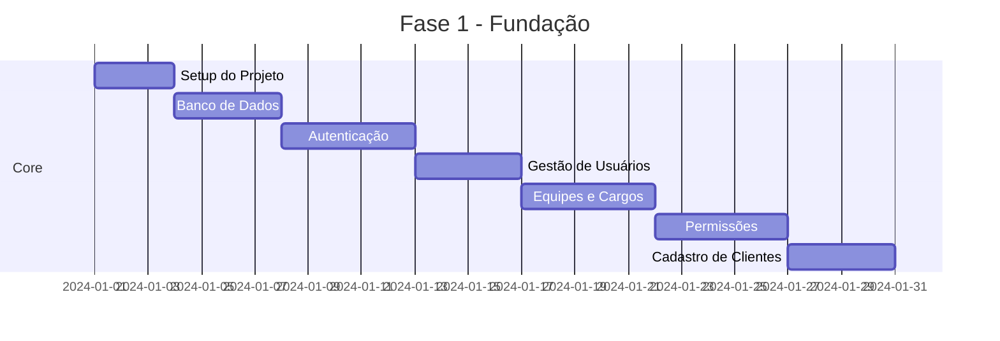

# Miq2 - Plano de Desenvolvimento

## Visão Geral

O **Miq2** é um sistema integrado de gestão de projetos, serviços e atendimento (Service Desk) para a empresa Acesso Informática, especializada em ERP para varejo e tributário.

---

## Módulos do Sistema

### 📊 Módulo 1: Core (Base do Sistema)
**Prioridade:** Alta | **Dependências:** Nenhuma

| Funcionalidade | Descrição |
|----------------|-----------|
| Autenticação | Login, logout, recuperação de senha |
| Gestão de Usuários | CRUD de usuários do sistema |
| Gestão de Equipes/Times | Criação e gerenciamento de equipes |
| Gestão de Cargos | Definição de cargos e hierarquias |
| Permissões Granulares | Controle de acesso por cargo/função |
| Gestão de Clientes | Cadastro de clientes e contatos |

---

### 📦 Módulo 2: Produtos e Checklists
**Prioridade:** Alta | **Dependências:** Módulo 1

| Funcionalidade | Descrição |
|----------------|-----------|
| Cadastro de Produtos | Registro de softwares ERP disponíveis |
| Templates de Checklist | Modelos de rotinas de implantação |
| Versionamento de Checklists | Controle de versões dos templates |
| Vinculação Produto-Checklist | Associação de checklists aos produtos |

---

### 🚀 Módulo 3: Gestão de Implantações
**Prioridade:** Alta | **Dependências:** Módulos 1, 2

| Funcionalidade | Descrição |
|----------------|-----------|
| Criação de Implantação | Iniciar nova implantação para cliente |
| Cronograma (Gantt) | Visualização em gráfico de Gantt |
| Checklist de Implantação | Acompanhamento de etapas |
| Percentual de Completude | Cálculo automático de progresso |
| Relatórios de Implantação | Modelo inicial e de finalização |
| Anexos e Termos de Aceite | Upload de documentos assinados |
| Histórico de Implantações | Log completo por cliente |

---

### 🔧 Módulo 4: Ordens de Serviço (OS)
**Prioridade:** Média | **Dependências:** Módulo 1

| Funcionalidade | Descrição |
|----------------|-----------|
| Modelos de O.S. | Templates para manutenção de hardware |
| Criação de O.S. | Abertura de ordem de serviço |
| Controle de Equipamentos | Registro de entrada/saída |
| Status da O.S. | Acompanhamento do andamento |
| Finalização e Histórico | Conclusão e registro histórico |

---

### 📅 Módulo 5: Agenda e Tarefas
**Prioridade:** Média | **Dependências:** Módulos 1, 3, 4

| Funcionalidade | Descrição |
|----------------|-----------|
| Dashboard Calendário | Visualização de agenda dinâmica |
| Agendamento de Tarefas | Criação e atribuição de tarefas |
| Diário de Bordo | Registro de observações nas tarefas |
| Sinalização de Bloqueios | Pausa de SLA/Cronograma |
| Atribuição a Equipes | Tarefas por time/usuário |
| Separação de Dashboards | Agenda vs Implantação |

---

### 🏃 Módulo 6: Sprint/Reunião Semanal
**Prioridade:** Média | **Dependências:** Módulos 3, 5

| Funcionalidade | Descrição |
|----------------|-----------|
| Aba de Sprint | Visualização semanal de tarefas |
| Pauta Automática | Geração baseada em pendências |
| Tarefas Concluídas | Resumo da semana anterior |
| Tarefas Pendentes | O que está em aberto |
| Notificações de Atraso | Alertas por e-mail |

---

### 💬 Módulo 7: Central de Atendimento (Omnichannel)
**Prioridade:** Alta | **Dependências:** Módulo 1

| Funcionalidade | Descrição |
|----------------|-----------|
| Integração WhatsApp (WABA) | Conexão com API oficial |
| Fila de Atendimento | Monitoramento em tempo real |
| Tela de Suporte | Interface para atendentes |
| Transferência de Chamados | Entre setores/usuários |
| Respostas Rápidas | Templates de respostas |
| Histórico de Conversas | Registro unificado por cliente |

---

### 🤖 Módulo 8: Chatbot (Autoatendimento)
**Prioridade:** Média | **Dependências:** Módulo 7

| Funcionalidade | Descrição |
|----------------|-----------|
| Menu de Triagem | Seleção de departamento |
| Consulta de Status | Implantação/Manutenção |
| Agendamento de Visitas | Solicitação via bot |
| Integração Financeira | Consulta de débitos |
| Segunda Via de Boleto | PDF/Linha digitável automática |

---

### 📁 Módulo 9: Repositório/GED
**Prioridade:** Baixa | **Dependências:** Módulo 1

| Funcionalidade | Descrição |
|----------------|-----------|
| Upload de Arquivos | Scripts, executáveis, manuais |
| Versionamento | Controle de versões de arquivos |
| Categorização | Organização por tipo/equipe |
| Download e Acesso | Gestão de permissões |
| Storage Externo | Integração com File System/Object Storage |

---

### 📈 Módulo 10: Dashboards e Relatórios
**Prioridade:** Baixa | **Dependências:** Todos os módulos

| Funcionalidade | Descrição |
|----------------|-----------|
| Dashboard Geral | Visão executiva do sistema |
| Dashboard por Equipe | Métricas específicas |
| Relatórios Customizados | Geração sob demanda |
| Exportação | PDF, Excel, CSV |

---

## Fases de Desenvolvimento

### 🔷 Fase 1: Fundação (Semanas 1-4)
**Objetivo:** Estabelecer a base técnica e funcional do sistema

**Entregas:**
- [ ] Estrutura do projeto (frontend + backend)
- [ ] Banco de dados PostgreSQL configurado
- [ ] Sistema de autenticação JWT
- [ ] CRUD completo de usuários
- [ ] Gestão de equipes e cargos
- [ ] Sistema de permissões granulares
- [ ] Cadastro de clientes e contatos

---

### 🔷 Fase 2: Produtos e Implantações (Semanas 5-8)
**Objetivo:** Implementar o coração do sistema - gestão de implantações

**Entregas:**
- [ ] Cadastro de produtos ERP
- [ ] Sistema de templates de checklist
- [ ] Criação e gestão de implantações
- [ ] Gráfico de Gantt interativo
- [ ] Cálculo de percentual de completude
- [ ] Upload de termos de aceite
- [ ] Relatórios de implantação (inicial e final)

---

### 🔷 Fase 3: Ordens de Serviço e Agenda (Semanas 9-12)
**Objetivo:** Gerenciamento de OS e tarefas diárias

**Entregas:**
- [ ] Modelos de O.S. para hardware
- [ ] Fluxo completo de O.S. (abertura → fechamento)
- [ ] Controle de entrada/saída de equipamentos
- [ ] Dashboard de calendário/agenda
- [ ] Sistema de tarefas e diário de bordo
- [ ] Sinalização de bloqueios/impedimentos

---

### 🔷 Fase 4: Sprint e Notificações (Semanas 13-14)
**Objetivo:** Gestão de reuniões semanais e alertas

**Entregas:**
- [ ] Aba de Sprint semanal
- [ ] Geração automática de pauta de reunião
- [ ] Sistema de notificações por e-mail
- [ ] Alertas de tarefas atrasadas

---

### 🔷 Fase 5: Repositório e Dashboards (Semanas 15-17)
**Objetivo:** Ferramentas de apoio e visualização

**Entregas:**
- [ ] Sistema de repositório de arquivos
- [ ] Versionamento de documentos
- [ ] Dashboards gerenciais
- [ ] Relatórios customizados
- [ ] Exportação de dados

---

### 🔷 Fase 6: Central de Atendimento (Semanas 18-21)
**Objetivo:** Implementar o módulo omnichannel (integração com sistema existente)

> ⚠️ **Nota:** A empresa já possui sistema de WhatsApp e chatbot. Esta fase foca na integração com o sistema existente.

**Entregas:**
- [ ] Integração com API WhatsApp Business (WABA)
- [ ] Tela de atendimento ao cliente
- [ ] Fila de atendimento em tempo real
- [ ] Sistema de transferência de chamados
- [ ] Respostas rápidas/templates
- [ ] Histórico unificado de conversas

---

### 🔷 Fase 7: Chatbot e Autoatendimento (Semanas 22-24)
**Objetivo:** Integração com chatbot existente

> ⚠️ **Nota:** A empresa já possui chatbot. Esta fase foca na integração com o sistema existente.

**Entregas:**
- [ ] Integração com menu de triagem existente
- [ ] Consulta de status via bot
- [ ] Agendamento de visitas
- [ ] Integração com sistema financeiro (API)
- [ ] Segunda via de boleto automática

---

## Stack Tecnológica Recomendada

### Backend
| Tecnologia | Uso |
|------------|-----|
| **Python + FastAPI** | API REST |
| **PostgreSQL** | Banco de dados principal |
| **SQLAlchemy** | ORM |
| **Redis** | Cache e filas |
| **Celery** | Tarefas assíncronas |

### Frontend
| Tecnologia | Uso |
|------------|-----|
| **React.js** | SPA Frontend |
| **TypeScript** | Tipagem estática |
| **Ant Design / MUI** | Componentes UI |
| **Chart.js / Recharts** | Gráficos |
| **FullCalendar** | Calendário/Agenda |

### Infraestrutura
| Tecnologia | Uso |
|------------|-----|
| **Docker** | Containerização |
| **Nginx** | Proxy reverso |
| **MinIO** | Object Storage (arquivos grandes) |

### Integrações
| Serviço | Uso |
|---------|-----|
| **WhatsApp Business API** | Chatbot |
| **API Financeira Acesso** | Consulta de boletos |
| **SMTP** | Notificações por e-mail |

---

## Critérios de Aceite por Módulo

### Módulo Core
- ✅ Usuário consegue fazer login/logout
- ✅ Admin consegue criar usuários, equipes e cargos
- ✅ Permissões são respeitadas em todas as telas
- ✅ Clientes são cadastrados com histórico acessível

### Módulo Implantações
- ✅ Implantação é criada com checklist vinculado
- ✅ Progresso é calculado automaticamente
- ✅ Gráfico de Gantt exibe cronograma corretamente
- ✅ Termos de aceite podem ser anexados

### Módulo Atendimento
- ✅ Mensagens do WhatsApp aparecem na tela de suporte
- ✅ Transferência entre setores funciona
- ✅ Histórico é salvo e consultável

---

## Próximos Passos

1. **Revisar e aprovar** este plano de desenvolvimento
2. **Definir prioridades** específicas com stakeholders
3. **Iniciar Fase 1** - Setup e módulo Core
4. **Sprints semanais** com entregas incrementais

---

*Documento gerado em: Janeiro 2026*
*Versão: 1.0*
